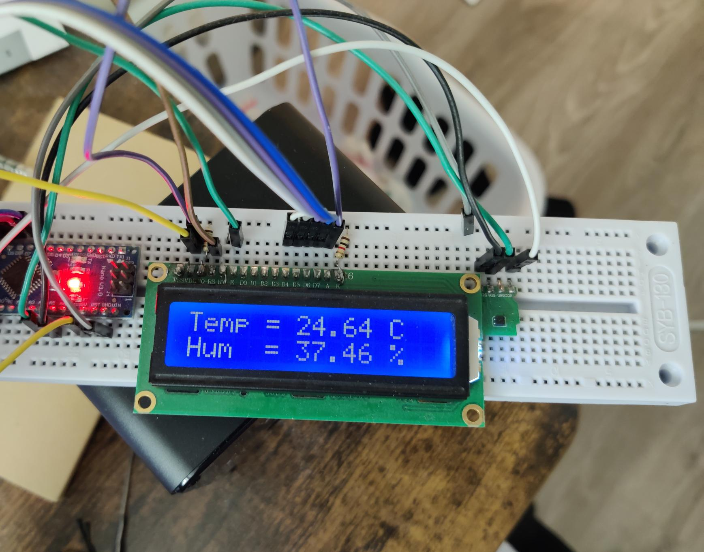
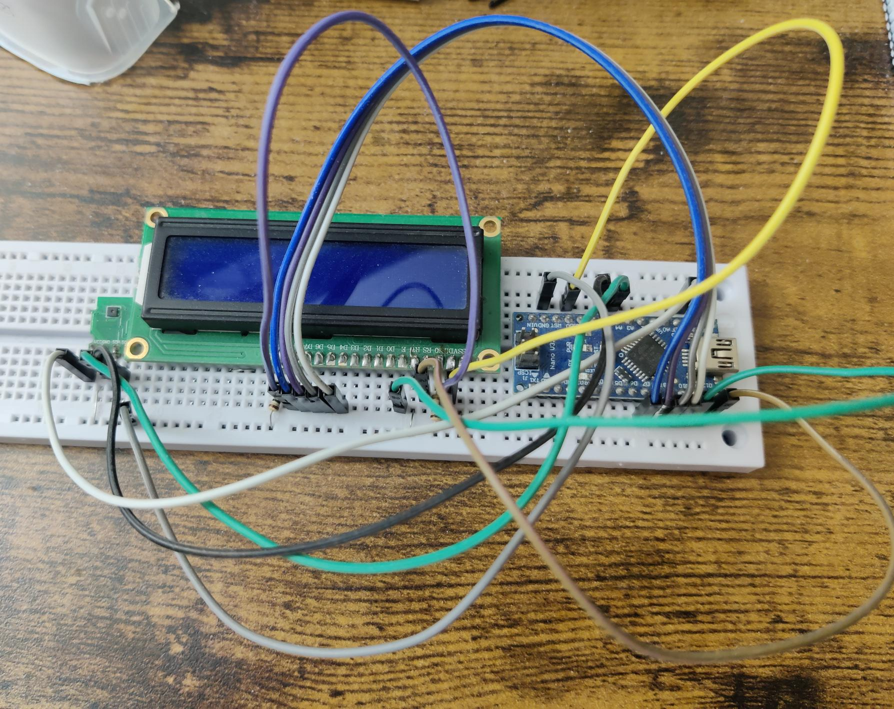

# Arduino_DHT22
An Arduino project using a DHT22 sensor to display temperature and humidity on an LCD or via serial output.

## Features
- Temperature and humidity measurements (Res. 0.1%RH, 0.1 &deg;C).
- Output via serial monitor, or
- Display on 16x2 LCD with backlight.

## Hardware used
- Arduino (I use Nano V3, but should be compatible to others as well)
- DHT22 Sensor: For measuring temperature and humidity.
- 16x2 LiquidCrystal LCD: For display.
- 2 resistors: For adjusting the backlight (LED+/-) and display contrast (Vo)

    Resistances vary. I use 2 x 1k Ohms for my setup and they work pretty well. You could also swap in a potentiometer if you want to tweak things more finely
- Jumper wires

## Software Requirements
This project requires the following libraries:

- LCD Interface
    - `LiquidCrystal.h` - Required for controlling the LCD display.

- DHT22 library
    - `DHT.h` - Used in the serial output version
    - `Adafruit_SHTC3.h` - Additional library for easier sensor handling (used in the LCD display version)

## Installation

### Hardware Setup
Ahh I am too tired to draw. See photo for the LCD version. Serial version is virtually the same but without the LCD:

## Code Structure
There are two code files, each works independently.
- `SerialOutput.ino`: Reads from the DHT22 sensor and outputs data to the serial monitor. Include `"DHT.h"`
- `LCDDisplay.ino`:  Reads sensor data and displays it on the LCD. Include `"LiquidCrystal.h"` and `"Adafruit_SHTC3.h"`

## Contributing
This is a old project built years ago. It references multiple resources which are now hard to track. Feel free to fork this project and contribute your improvements for non-commersial purposes

## License
This project is released under GNU GPL-3.